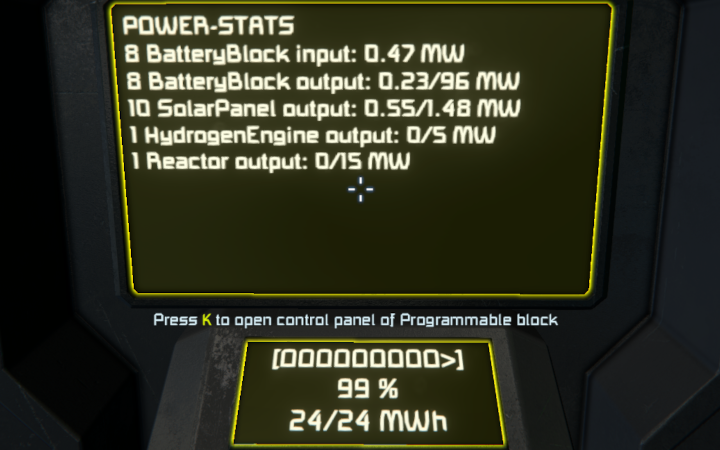

# Short description
An in-game-script for Space Engineers showing power statistics on programmable blocks and LCDs.

With this script one is able to see, if the power-trend is increasing or decreasing, what power-producers are on the grid and how many batteries are available.

I needed this, because my first buildings had too less batteries and too less power-producers. This script is also very helpful on space ships to manage the power-drop from jump-drives.

# Custom Data (Properties)
If you change the Custom Data of the programmable block the script is running on, you need to recompile the script to get the changes active.

## Another text-surface
You can define another text-surface to use for output of the stats.

### text-surface (string)

This `string`-property will define the name of the block with a text-surface (display) where to print the power-stats to. If it is not defined, the displays of the programmable block will be used.
Currently only the first available text-surface on the given block will be used. (I have an idea to split the visual battery and the stats to be shown on defineable text-surfaces someday).

## Steam Workshop

[https://steamcommunity.com/sharedfiles/filedetails/?id=2447358477](https://steamcommunity.com/sharedfiles/filedetails/?id=2447358477)
